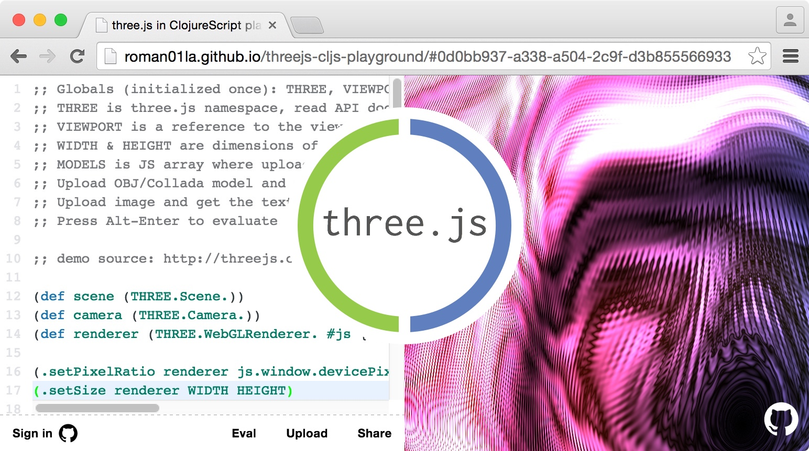

# three.js playground in ClojureScript



The playground is running on bootstrapped ClojureScript and stores shared demos on Firebase.

Write some code, upload textures, OBJ/Collada models (more formats is coming soon) and hit `Alt-Enter` to evaluate and see results immediately.

After every evaluation the namespace is populated with the following vars:

- `THREE` — three.js namespace
- `VIEWPORT` — reference to canvas DOM element
- `WIDTH` & `HEIGHT` — viewport dimensions in `px`
- `MODELS` — JS array with your compiled models
- `MODELS_DATA` — JS array with parsed models data to be compiled and stored into `MODELS`
- `TEXTURES` — JS array with compiled textures
- `TEXTURES_DATA` — JS array with images to be compiled and stored into `TEXTURES`
- `RENDERER` & `CAMERA` — assign your renderer and camera instances to these vars to let me handle window resizing for you...

```clojurescript
(set! RENDERER renderer)
(set! CAMERA camera)
```

- `RAF` — ID of the current `requestAnimationFrame` call, this is the important one...

Make sure you are always assigning returning value of `requestAnimationFrame` call to global `RAF` var, like this:

```clojurescript
(set! RAF (js/requestAnimationFrame render))
```

This is required to drop current rendering loop before running a new one after each evaluation.
